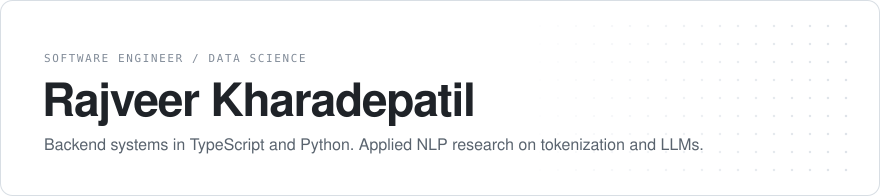
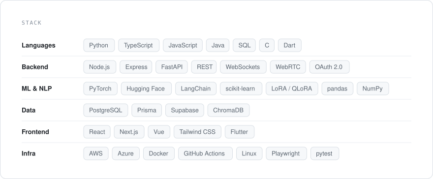
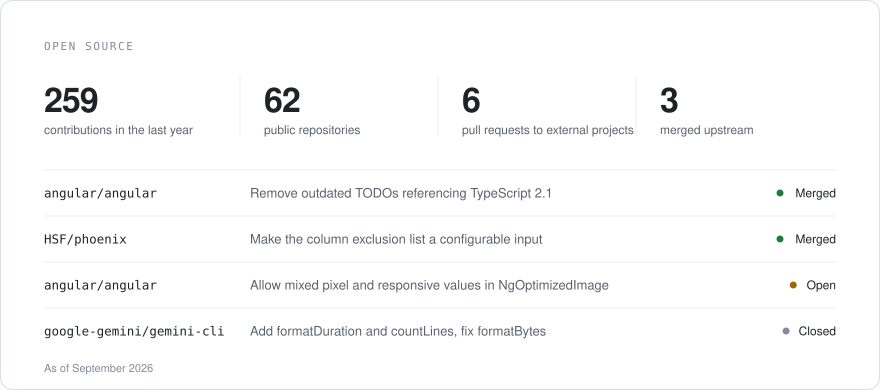

<picture>
  <source media="(prefers-color-scheme: dark)" srcset="assets/header-dark.svg">
  
</picture>

<picture>
  <source media="(prefers-color-scheme: dark)" srcset="assets/stack-dark.svg">
  
</picture>

<picture>
  <source media="(prefers-color-scheme: dark)" srcset="assets/oss-dark.svg">
  
</picture>

  <a href="mailto:rajveerkharade9@gmail.com">rajveerkharade9@gmail.com</a>

